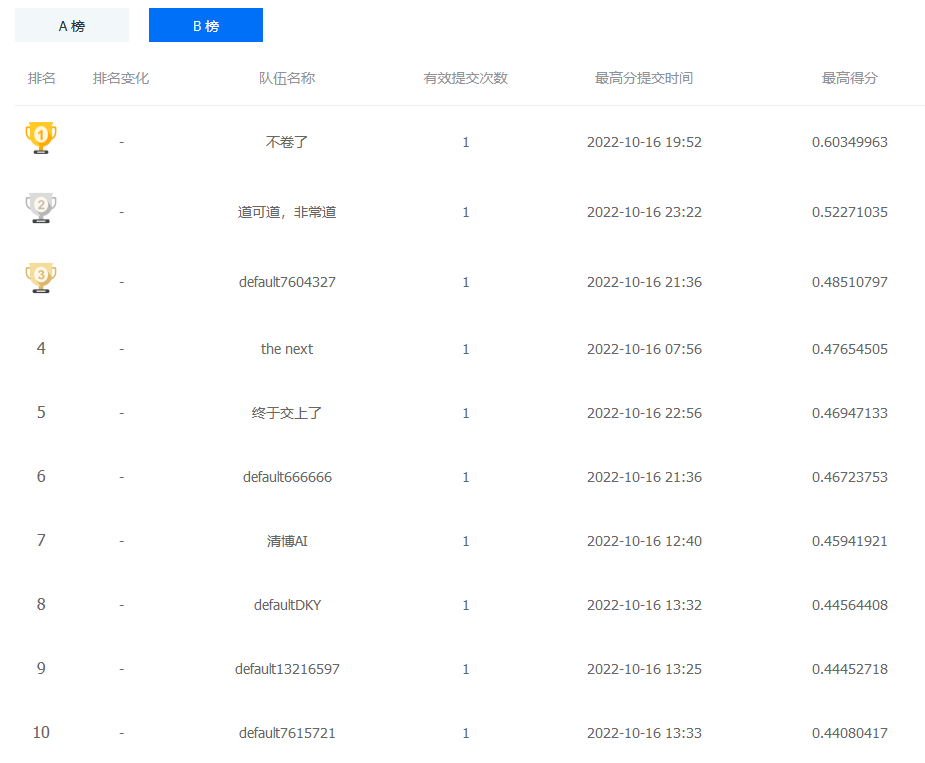
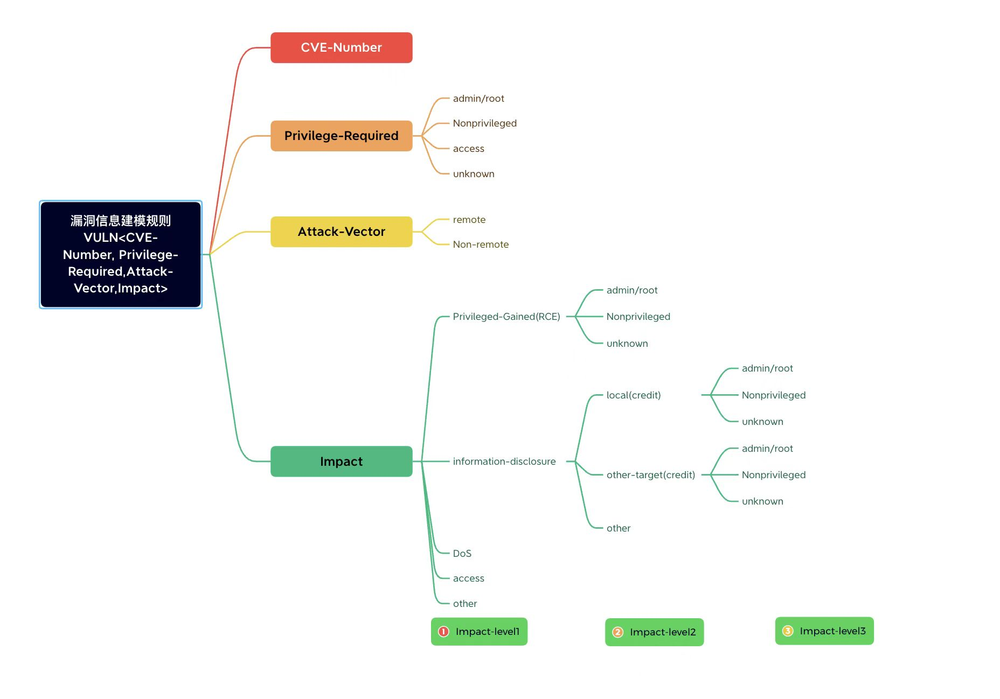

# VulnClassifier ReadMe

## intro

This repo is our source code for competition [基于人工智能的漏洞数据分类](https://www.datafountain.cn/competitions/594/datasets) , which is a Text Classification Task. Our final rank is 8th.




This task need model read the natural language description of a cve, then output five cve tags from the next class:

```
privilege_required
attack_vector
impact_1
impact_2
impact_3
```

Refer to the picture below:



> Tips: If impact_1 is Dos then the impact_2 should be none.


The official labeled traindata is `dataset/labeled/train.json`, unlabeled traindata is `dataset/unlabeled_data.json`, testdata A is `dataset/test_a.json` testdata B is `dataset/test_b.json`. 

The unlabeled traindata need players to tag them. This is the most hard part. I write the label rules in `makeLabel.py`, and use it to label the external data `dataset/unlabeled/nvdcve-1.1-train.json` that I found from nvd-cve-database **corresponding to the official labeled traindata**, so I could check the labels accuracy by the code in end of this script. It is a pity that our rules is weak, since we are busy with other work. The final labels accuracy by our rules is 30%, 😢.

I believe that make rules to make sure part of the unlabeled dataset are labeled correctly, this strategy is more helpful for training model.

 

## train and test

install main dependence:  

```
openpyxl
numpy
torch
transformers
datasets
jsonlines
```

run command:

`python train_submit_version.py`

All important arguments are written in top of this script. This script will train model on `train_data_path` with `EPOCHS`, train on `train_data_path2` with `EPOCHS2`, and test on `test_data_path`, then generate submit results on `submission_data_path` and save to `result_path`. The model will save to `save_model_path`.


## note

The bert-based model is defined in **model.py**, the train and test process of this model are defined in **train_bert.py**. 

The lstm-based model is defined in **model.py**, the train and test process of this model are defined in **train_lstm.py**.

- **static_dataset.py** write the utils for static dataset.

- **makeLabel.py** is used to label the unlabeled dataset provided by the organizer.

- **utils.py** is the map between label and tensor, and a function for make results resonable.

- **dataset.py** is the dataset for training and submitting.
- **train_submit_version.py** train, test and generate results.


## references

the nvd cve database download link:  
https://nvd.nist.gov/vuln/data-feeds#JSON_FEED

Common Vulnerability Scoring System version 3.1: Specification Document (cvss 3):  
https://www.first.org/cvss/specification-document

cvss 2:  
https://www.first.org/cvss/v2/guide

